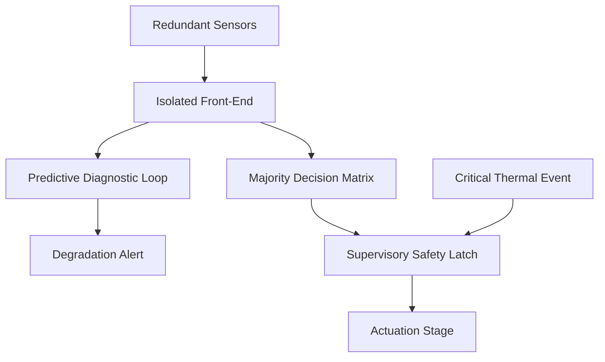

# Decoupled TMR Thermal Control Architecture  
**Technical Teaser & Architectural Overview**

[]()
[]()
[]()
[]()

> **⚠️ CONFIDENTIAL – UNDER REVIEW FOR PUBLICATION**  
> This repository provides a high-level architectural overview and performance summary only.  
> Full circuit schematics, discrete logic implementations, component-level details, exact Boolean expressions, truth tables, and experimental raw data are **intentionally withheld**.  
> Complete technical specifications are available **upon formal request** for peer verification, collaboration, or licensing discussions.

---

## Overview

This research introduces a **decoupled Triple Modular Redundant (TMR)** thermal control architecture engineered for high-reliability industrial and aerospace applications.  

Traditional TMR systems mask single-sensor failures but leave the platform vulnerable to “silent” redundancy loss. The proposed framework addresses this limitation through four electrically isolated functional layers that combine classical majority voting with **predictive degradation monitoring** and an autonomous **hardware safety override**.

### Core Value Proposition

- Eliminates inter-channel cross-talk and impedance loading  
- Detects sensor degradation *before* redundancy is lost  
- Provides instantaneous hardware-enforced fail-safe lockout  
- Converts classical MTTF into a repairable MTBF via proactive diagnostics  
- Delivers quantified risk reduction against unannounced secondary failures  

---

## Architectural Layers (High-Level)

| Layer                        | Functional Role                                              |
|-----------------------------|--------------------------------------------------------------|
| **Isolated Sensing Front-End** | High-impedance buffering of three redundant temperature sensors to prevent cross-talk and cascading failures |
| **Majority Decision Matrix**   | Strict 2-out-of-3 voting that suppresses single-channel false readings without interrupting operation |
| **Predictive Diagnostic Loop** | Continuous comparison of each channel against a dynamic group-average reference; raises localized degradation alerts |
| **Supervisory Safety Latch**   | Edge-triggered autonomous override that forces a Master-Off state under severe thermal runaway; requires manual reset |



---

## Key Performance Outcomes

| Metric                              | Classical TMR              | Proposed Framework                  |
|-------------------------------------|----------------------------|-------------------------------------|
| Mathematical Reliability            | \( 3R^2 - 2R^3 \)          | Identical envelope                  |
| Drift / Degradation Detection       | Silent (masked)            | Active & predictive                 |
| Fault Coverage (injected faults)    | 0 % for drift              | 97 % ± 3.4 %                        |
| Diagnostic Latency                  | N/A                        | 250 ms ± 14 ms                      |
| Secondary Failure Risk Reduction    | Baseline                   | ≈ 209×                              |
| Steady-State Availability           | Lower                      | Higher (repairable S3D state)       |
| Hardware Fail-Safe Override         | Software-dependent         | Autonomous hardware latch           |

### Reliability Insights (Summary)

- Classical TMR reliability: \( R_{TMR} = 3R^2 - 2R^3 \)
- Identified and resolved the **MTTF Paradox** (TMR MTTF = \( 5/6\lambda \)) versus mission reliability
- Introduced diagnostic state **S3D** that enables proactive maintenance, converting MTTF → MTBF
- Risk Reduction Factor against unannounced secondary failure ≈ **209×** under representative maintenance windows

Detailed Markov models, uncertainty analysis, and comparative tables are summarized in the `docs/` folder (still at teaser depth).

---

## Repository Contents

```text
.
├── README.md                          ← This teaser overview
├── LICENSE                            ← Proprietary / On-Request Access
├── CITATION.cff
├── docs/
│   ├── architectural_overview.md      ← Layer responsibilities (no component IDs)
│   ├── reliability_outcomes.md        ← Performance metrics & high-level models
│   └── design_philosophy.md           ← Safety & maintainability rationale
├── hardware/                          ← Placeholder (full BOM & schematics on request)
├── analysis/                          ← Placeholder (raw data on request)
└── images/                            ← Placeholder (figures on request)
```

---

## Authors

**Syed Umar Ali** (Lead Researcher)  
Department of Industrial Electronics Engineering  
IIEE-NEDUET  
Email: `umarali.35@iiee.edu.pk`

---

## Access & Citation Policy

This work is **proprietary** and currently under review.  

- Public disclosure of implementation details is prohibited.  
- Full technical package (schematics, discrete logic, BOM, experimental logs, exact equations) is released **only upon formal written request** for legitimate verification, academic collaboration, or licensing.  
- Contact the author for access or citation permissions.

See `LICENSE` and `CITATION.cff` for formal statements.
